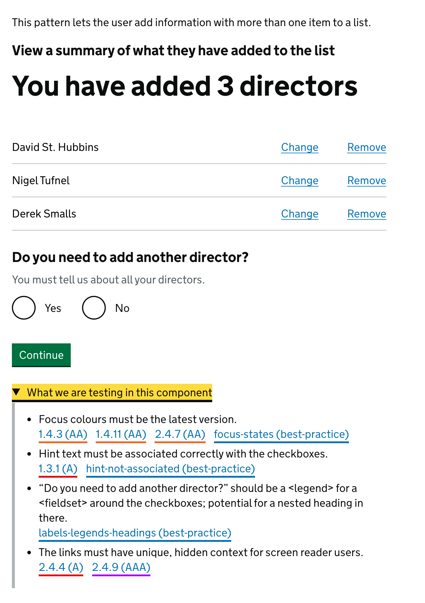

# GOV.UK Cypress framework

A demonstration of how to use the [Cypress](https://www.cypress.io/) framework to test GOV.UK & HMRC components and patterns.

Install instructions are further down.

## What this is not

This is **not** a replacement for the tests that come with the GOV.UK Prototype Kit—far, *far* from it.

## What this is

This is an educational project to promote better accessibility knowledge when using these components in your daily job.

### The primary aim

> ***“To promote testing in a way that makes people think about accessibility as they use these components in their daily jobs.”***

I’ve added the examples of each component from the GOV.UK Design System and HMRC Pattern Library, but then added a `details` section underneath. This is where the education (*hopefully*) kicks in.

Not everyone knows **what** they should be testing, so it’s no surprise that so many services arrive at the accessibility team in the state they do and get sent back to the service team with a long list of issues to fix. So, my idea is that teams can read through this and have a better understanding of what they need to pay attention to, in order to put them in a better position to deliver a good service.

This whole project started because I’d been using Cypress a fair bit lately, so I’d been looking at ways to reuse code. I’d also seen a large gap in how people are testing their work during my two years of auditing services on the accessibility team.

#### Example: HMRC’s “add to a list” component

URL: `http://localhost:3000/hmrc/add-to-a-list`

Using the “Add to a list” component as an example, shown in the image below, there is a `details` component which contains a list of what we’re wanting to test. I’ve recreated that here:

  
What we are testing in this component

  <ul>
    <li>The focus colours must be the updated version.</li>
    <li>The hint text must be associated correctly with the checkboxes.</li>
    <li>“Do you need to add another director?” should be a `legend` for a `fieldset` around the checkboxes; potential for a nested heading in there.</li>
    <li>The links must have unique, hidden context for screen reader users.</li>
  </ul>

Written in clear English, these instructions are tucked away in [`components.js`](app/components.js) and pulled in for each component example.

Because these are things that we have to do time and time again, I’ve made each one a separate Cypress Command that you can call:

- [`cy.get("@component").click().checkFocusColours();`](./cypress/support/govuk-cypress/govuk--focus-colours.js)
- [`cy.get("@component").checkAriaDescribedBy();`](./cypress/support/govuk-cypress/govuk--aria-describedby.js)
- [`cy.get("@component").checkHeadings();`](./cypress/support/govuk-cypress/govuk--headings.js)
- [`cy.get("@component").checkLinkContext();`](./cypress/support/govuk-cypress/govuk--link-context.js)

### The secondary aim

> ***“To try and target which tests can be pulled out into a plugin for people who regularly use these components.”***

I’ve already written each test separately, but maybe there are some components or patterns where you think you could help out; or, even better, improve what’s here.

Because I’m just one person, I’m hoping that there might be some traction here and others might pick up a few other components, or patterns. Besides, I’m rubbish at this.

## Install and run

1. Clone the repo: `gh repo clone philsherry/govuk-cypress`
   - [GitHub CLI](https://cli.github.com/)
   - [GitHub Desktop](https://desktop.github.com/)
2. Install the dependencies: `npm install`
3. Install Cypress: `npm run cypress:install`
4. Start the server: `npm start`
5. Visit the page in your browser: `http://localhost:3000`
6. Open Cypress to run some tests: `npm run cypress:open`

### Tools

- [Visual Studio Code](https://code.visualstudio.com/)

## Custom Cypress Commands

### Scenario one

A service team has used the Design System to scope out some components and patterns for the service they're building, but their version of the Play Framework is old and they have to manually copy/paste a bunch of stuff to manually recreate things in a less-than-optimal way. (These things happen.) One thing they *didn’t* manage to do, was bring over the latest [focus states](https://design-system.service.gov.uk/get-started/focus-states/). But now, by running `cy.get("@component").click().checkFocusColours();` in their tests, they’ll get that flagged before they get anywhere near the accessibility team.

### Scenario two

There have been too many times when I saw an error summary pattern where the links had no matching targets, or the links were ordered in an illogical way. The Error summary pattern is unique enough to GOV.UK services that it made sense to have a specific test which checks that each link in the summary box has a corresponding target in the page, and in the same order. `cy.get("@component").checkGovukErrorSummary();` checks for all of these things.

You get the picture.

While there are a few tests at the moment, they’re nowhere near perfect and PRs are welcome to improve things.

- `cy.checkPageTitle();`
  Cypress function to check the page title has the correct elements, with an argument to bypass when the page has personally identifiable information.
- `cy.get("@component").click().checkFocusColours();`
  Cypress function to check the focus colours match the latest GOV.UK Design System.
- `cy.get("@component").checkLinkContext();`
  Cypress function to check each link has enough unique context for screen reader users to understand its purpose.
- `cy.get("@component").checkAriaDescribedBy();`
  Cypress function to check any `aria-describedby` value has a valid target in the page.
- `cy.get("@component").checkAriaLabelledby();`
  Cypress function to check any `aria-labelledby` value has a valid target in the page.
- `cy.get("@component").checkGovukErrorMessage();`
  Cypress function to check each error message on the page conforms to the standards set by the GOV.UK Design System.
- `cy.get("@component").checkGovukErrorSummary();`
  Cypress function to check each error summary link has a valid target in the page.
- `cy.get("@component").checkHmrcCurrencyInput();`
  Cypress function to check the HMRC Currency Input pattern.
- `cy.get("@component").checkHmrcPageHeading();`
  Cypress function to check the HMRC Page Heading pattern.
- `cy.get("@component").checkHmrcTimeline();`
  Cypress function to check the HMRC Timeline component.

## Components

The components that will be tested are from [HMRC’s Design Patterns](https://design.tax.service.gov.uk/hmrc-design-patterns/) and [GOV.UK’s Design System](https://design-system.service.gov.uk/). This is very much a work in progress (using the [GOV.UK Prototype Kit](https://github.com/alphagov/govuk-prototype-kit)), so feel free to raise a PR and pitch in.

### GOV.UK Design System

- Accordion
- Back link
- Breadcrumbs
- Button
- Character count
- Checkboxes
- Cookie banner
- Date input
- Details
- Error message
- Error summary
- Fieldset
- File upload
- Footer
- Header
- Inset text
- Notification banner
- Panel
- Phase banner
- Radios
- Select
- Skip link
- Summary list
- Table
- Tabs
- Tag
- Text input
- Textarea
- Warning text

### HMRC Design Patterns

- Account header
- Accounts office reference
- Add to a list
- Ask the user for their consent
- Confirmed identity
- Could not confirm identity
- Currency input
- Employer PAYE reference
- HMRC banner
- Internal header
- Match an organisation to HMRC records
- Notification badge
- Page heading
- Page not found
- Page title
- Service timeout
- Service unavailable
- Sign out
- Status tags in Task list pages
- There is a problem with the service
- Timeline
- Unique Taxpayer Reference
- VAT registration number
- Welsh language toggle
